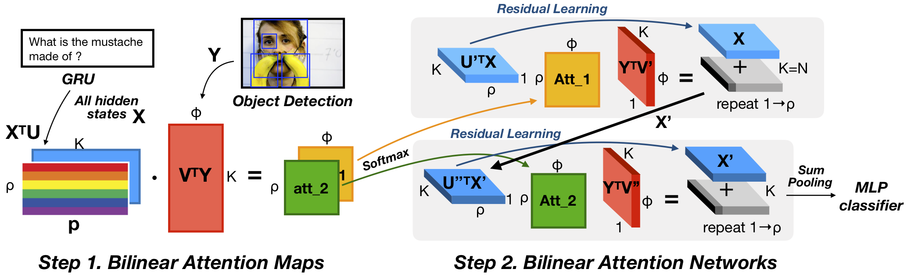

# Bilinear attention networks for KVQA


This repository is an implementation of [Bilinear Attention Networks](http://arxiv.org/abs/1805.07932) for the visual question answering task using the KVQA dataset.




The 5-fold cross-validation scores are shown as follows:

| Embedding | Dimension |          All          |  Yes/No   |  Number   |   Other   | Unanswerable |
| --------- | :-------: | :-------------------: | :-------: | :-------: | :-------: | :----------: |
| [Word2vec](https://arxiv.org/abs/1310.4546)  | [200](https://github.com/Kyubyong/wordvectors)       |   37.23 ± 0.11    | **66.95** |   20.47   |   20.08   |  **93.57**   |
| [GloVe](https://nlp.stanford.edu/projects/glove/)     | [100](https://ratsgo.github.io/embedding)       |   37.91 ± 0.08    |   65.98   |   20.76   |   21.97   |    93.18     |
| [fastText](https://arxiv.org/abs/1607.04606)  | [200](https://github.com/Kyubyong/wordvectors)       | **38.16 ± 0.13**  |   66.05   | **20.79** | **22.45** |    92.72     |
| [BERT](https://arxiv.org/abs/1810.04805)      | [768](https://github.com/google-research/bert)       | 37.95  ± 0.10 |   63.77   |   20.46   |   22.35   |    92.92     |


This repository is based on and inspired by @hengyuan-hu's [work](https://github.com/hengyuan-hu/bottom-up-attention-vqa). We sincerely thank for their sharing of the codes.


### Prerequisites

You may need a machine with a Titan-grade GPU, 64 GB memory, and `PyTorch v1.1.0` for `Python3`. We highly recommend you to use [this](https://hub.docker.com/layers/pytorch/pytorch/1.1.0-cuda10.0-cudnn7.5-runtime/images/sha256-299bfb9e54db1b2640d59caa6b7432a2b63002ec00154fd9dca4a08796a5f54a) docker image.

```bash
pip install -r requirements.txt
```

Install mecab
```bash
sudo apt-get install default-jre curl
bash <(curl -s https://raw.githubusercontent.com/konlpy/konlpy/master/scripts/mecab.sh)
```

### KVQA Dataset

You can download the KVQA dataset via [this link](https://drive.google.com/drive/folders/1hqnCxlWq5JAxnj_wsXjteH0UFhS7RMHW?usp=sharing). Please be aware that this is licensed via `Korean VQA License`.

### Preprocessing

Our implementation uses the pretrained image features by [bottom-up-attention](https://github.com/peteanderson80/bottom-up-attention), the adaptive 10-100 features for the detected objects in an image.
In addition to this, the pretrained Korean word vectors, [Word2vec](https://github.com/Kyubyong/wordvectors), [GloVe](https://ratsgo.github.io/embedding), [fastText](https://github.com/Kyubyong/wordvectors) and [BERT](https://github.com/google-research/bert).

#### For simplicity, you can prepare the KVQA data as follows and use the below script to avoid a hassle:

1. Place the downloaded files from [`KVQA Dataset`](#kvqa-dataset) as follows:
```bash
data
├── KVQA_annotations.json
└── features
    ├── KVQA_resnet101_faster_rcnn_genome.tsv
    └── VizWiz_resnet101_faster_rcnn_genome.tsv
```
Notice that if you download the preprocessed features (the tsv files), you don't need to download image sources.

2. Run the two scripts, `download.sh` and `process.sh`.
```bash
./tools/download.sh
./tools/process.sh
```


### Training

Run

```bash
python3 main.py
```

to start training. The training and validation scores will be printed at every epoch, and the best model will be saved under the directory `saved_models`.

You can train a model based on the other question embedding by running as follows:

```bash
python3 main.py --q_emb glove-rg
```


### Citation

If you use this code as part of any published research, please consider to cite the following papers:

```
@inproceedings{Kim_Lim2019,
author = {Kim, Jin-hwa and Lim, Soohyun and Park, Jaesun and Cho, Hansu},
booktitle = {AI for Social Good workshop at NeurIPS},
title = {{Korean Localization of Visual Question Answering for Blind People}},
year = {2019}
}
@inproceedings{Kim2018,
author = {Kim, Jin-Hwa and Jun, Jaehyun and Zhang, Byoung-Tak},
booktitle = {Advances in Neural Information Processing Systems 31},
title = {{Bilinear Attention Networks}},
pages = {1571--1581},
year = {2018}
}
```

### License

* Korean VQA License for the KVQA Dataset
* Creative Commons License Deed ([CC BY 4.0](https://creativecommons.org/licenses/by/4.0/deed.ko)) for the VizWiz subset
* GNU GPL v3.0 for the Code

### Acknowledgments

We sincerely thank the collaborators from [TestWorks](http://www.testworks.co.kr/page/overview) for helping the collection.
