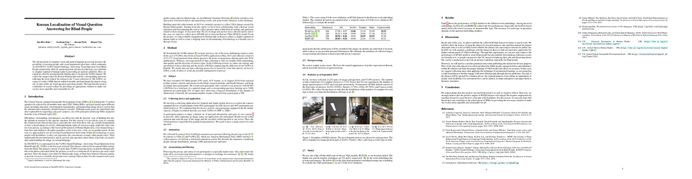

Back to [Korean](./).

SK Telecom pursues goals of adding social value to our society through various projects. We believe that the first step for sustainable development in management is to take the lead and discover social issues, and then offer solutions in full responsibility.

Since April 2019, we initiated a project in cooperation with [Testworks] (http://www.testworks.co.kr), a social enterprise in Korea and started to collect data from the blind people who volunteered in participating the project. Furthermore, we translated certain part of the published VizWiz dataset (https://vizwiz.org/tasks-and-datasets/vqa/) which can be also applicable within the Korean context, and create the full dataset to train Visual Question Answering (VQA) models in Korean language.

# Visual question answering

VQA understands provided images and if a person asks question about them, it provides an answer after understanding the images via natural language. 


# KVQA dataset

As part of T-Brain’s projects on social value, KVQA dataset, a Korean version of VQA dataset was created. KVQA dataset consists of photos taken by Korean visually impaired people, questions about the photos, and 10 different answers for each question.
Currently, it consists of 30,000 sets of image and question, and 300,000 answers, but by the end of this year, we will increase the dataset size to 100,000 sets of image and question, and 1 million answers.
This dataset can be used only for educational and research purposes. Please refer to the attached license for more details. We hope that the KVQA dataset can simultaneously provide an opportunity for further development of Korean VQA technology as well as social value in our society.


## Data statistics

### v0.1 (Oct. 2019)

|             | Overall (%)  | Yes/no (%)   | Number (%)   | Etc (%)        | Unanswerable (%) |
|:------------|:-------------|:-------------|:-------------|:---------------|:--------------|
| # images    | 30,031 (100) | 2,025 (6.74) | 2,029 (6.76) | 20,472 (68.17) | 5,505 (18.33) |
| # questions | 30,031 (100) | 2,025 (6.74) | 2,029 (6.76) | 20,472 (68.17) | 5,505 (18.33) |
| # answers   | 300,310 (100)| 20,250 (6.74)| 20,290 (6.76)| 204,720 (68.17)| 55,050 (18.33)| 

## Evaluation

We measure accuracy using answers collected from 10 different people for each question. If VQA provides 3 or more correct answers from the 10 answers, it gets 100%, and if less than 3, it gets a partial score proportionately. To be consistent with ‘human accuracies’, measured accuracies are averaged over all 10 choose 9 sets of human annotators. Please refer to [VQA Evaluation](https://visualqa.org/evaluation.html) which we follow.

## Data

### Data field description

| Name                             | Type     | Description                                              |
|:---------------------------------|:---------|:---------------------------------------------------------|
| VQA                              | `[dict]` | 시각적 질의응답 정보를 담은 `dict`의 `list`                     |
| +- image                         | `str`    | 이미지 파일의 이름                                           |
| +- source                        | `str`    | 데이터의 출처 `("kvqa", "vizwiz")`                          |
| +- answers                       | `[dict]` | 응답 정보를 담은 `dict` 10개의 `list`                         |
| +--- answer                      | `str`    | 시각적 질의에 대한 응답                                        |
| +--- answer_confidence           | `str`    | 응답에 대한 신뢰도 `("yes", "maybe", "no")`                   |
| +- question                      | `str`    | 이미지에 관련한 질의                                           |
| +- answerable                    | `int`    | 응답 가능 여부 `(0, 1)`                                       |
| +- answer_type                   | `str`    | 응답의 종류 `("number", "yes/no", "unanswerable", "other")`   |

### Data example

```json
[{
        "image": "KVQA_190712_00143.jpg",
        "source": "kvqa",
        "answers": [{
            "answer": "피아노",
            "answer_confidence": "yes"
        }, {
            "answer": "피아노",
            "answer_confidence": "yes"
        }, {
            "answer": "피아노 치고있다",
            "answer_confidence": "maybe"
        }, {
            "answer": "unanswerable",
            "answer_confidence": "maybe"
        }, {
            "answer": "게임",
            "answer_confidence": "maybe"
        }, {
            "answer": "피아노 앞에서 무언가를 보고 있음",
            "answer_confidence": "maybe"
        }, {
            "answer": "피아노치고있어",
            "answer_confidence": "maybe"
        }, {
            "answer": "피아노치고있어요",
            "answer_confidence": "maybe"
        }, {
            "answer": "피아노 연주",
            "answer_confidence": "maybe"
        }, {
            "answer": "피아노 치기",
            "answer_confidence": "yes"
        }],
        "question": "방에 있는 사람은 지금 뭘하고 있지?",
        "answerable": 1,
        "answer_type": "other"
    },
    {
        "image": "VizWiz_train_000000008148.jpg",
        "source": "vizwiz",
        "answers": [{
            "answer": "리모컨",
            "answer_confidence": "yes"
        }, {
            "answer": "리모컨",
            "answer_confidence": "yes"
        }, {
            "answer": "리모컨",
            "answer_confidence": "yes"
        }, {
            "answer": "티비 리모컨",
            "answer_confidence": "yes"
        }, {
            "answer": "리모컨",
            "answer_confidence": "yes"
        }, {
            "answer": "리모컨",
            "answer_confidence": "yes"
        }, {
            "answer": "리모컨",
            "answer_confidence": "yes"
        }, {
            "answer": "리모컨",
            "answer_confidence": "maybe"
        }, {
            "answer": "리모컨",
            "answer_confidence": "yes"
        }, {
            "answer": "리모컨",
            "answer_confidence": "yes"
        }],
        "question": "이것은 무엇인가요?",
        "answerable": 1,
        "answer_type": "other"
    }
]
```

# Paper

## AI for Social Good workshop at NeurIPS (Kim & Lim et al., 2019)

To appear


## Bilinear Attention Networks (Kim et al., 2018)

[Paper](http://papers.nips.cc/paper/7429-bilinear-attention-networks)


# Licenses

* Korean VQA License for the KVQA Dataset
* Creative Commons License Deed ([CC BY 4.0](https://creativecommons.org/licenses/by/4.0/deed.ko)) for the VizWiz subset
* GNU GPL v3.0 for the Code
