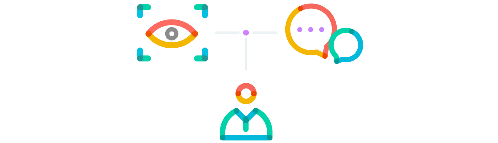
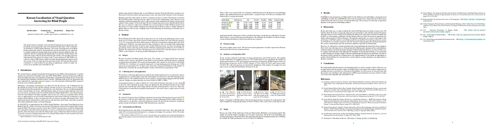
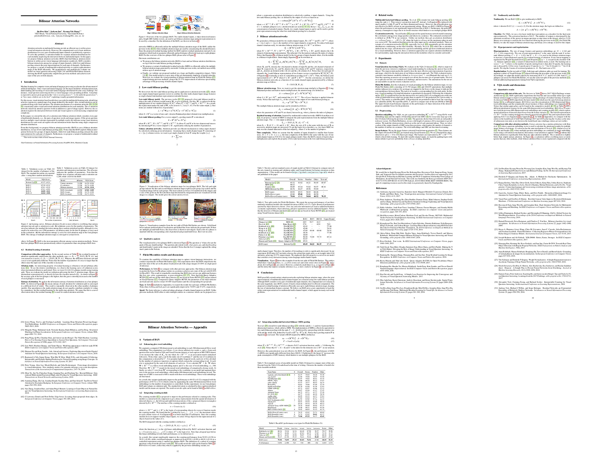

This page is also provided in [English](./index-en.html).

SK텔레콤은 사회적 가치 추구를 위한 다양한 사업을 진행하고 있습니다. 기업이 먼저 앞장서서 사회 속에 혼재된 사회적 이슈를 발굴하고, 이를 해결하기 위한 사회적 책임을 지는 것이 지속가능한 경영의 출발이라고 생각합니다.

2019년 4월부터 이 기술의 현지화를 위해 사회적 기업인 [테스트웍스](http://www.testworks.co.kr)와 협업하여 자발적으로 지원한 우리나라의 시각장애인들로부터 데이터를 수집하였고, 영문으로 공개된 VizWiz 데이터셋 중 현지화가 가능한 일부를 한국어로 번역하여 시각적 질의응답 기술을 한국어로 학습시킬 수 있는 데이터셋을 만들었습니다.

# 시각 질의 응답

시각적 질의응답은 이미지가 주어지고 그 이미지에 대한 질문이 주어졌을 때, 이미지를 이해하여 자연어로 질문에 대한 답을 주는 기술입니다.

# KVQA 데이터셋

KVQA 데이터셋은 T-Brain이 진행하는 사회적 가치 추구를 위한 프로젝트의 일환으로서, 한국형 시각적 질의응답(Visual Question Answering) 데이터셋입니다. KVQA 데이터셋은 한국 시각장애인들이 찍은 사진과 그 사진에 대한 질문과 서로 다른 열 명의 복수 답으로 구성되어 있습니다.
현재는 총 3만 건의 이미지와 질문, 그리고 30만 건의 답변으로 구성되어 있으나, 올해 말까지 10만 건의 이미지와 질문, 그리고 100만 건의 답변으로 증대할 예정입니다.
본 데이터셋은 교육 및 연구목적으로 사용이 가능하며, 자세한 내용은 첨부된 라이선스를 참조해주시기 바랍니다. KVQA 데이터셋을 통해 한국형 시각적 질의응답 기술 발전과 사회적 가치를 동시에 추구할 수 있기를 바랍니다.

## 통계

### v0.1 (2019년 10월)

|           | 전체 (%)      | 예/아니오 (%)  | 숫자 (%)      | 기타 (%)        | 답변불가능 (%)   |
|:----------|:-------------|:-------------|:-------------|:---------------|:--------------|
| 이미지 수   | 30,031 (100) | 2,025 (6.74) | 2,029 (6.76) | 20,472 (68.17) | 5,505 (18.33) |
| 질문 수     | 30,031 (100) | 2,025 (6.74) | 2,029 (6.76) | 20,472 (68.17) | 5,505 (18.33) |
| 답변 수     | 300,310 (100)| 20,250 (6.74)| 20,290 (6.76)| 204,720 (68.17)| 55,050 (18.33)|

# 논문

<dl>
<dt>AI for Social Good workshop at NeurIPS (Kim & Lim et al., 2019)</dt>
<dd></dd>
<dd>To appear</dd>
<dt>Bilinear Attention Networks (Kim et al., 2018)</dt>
<dd></dd>
<dd>[Paper](http://papers.nips.cc/paper/7429-bilinear-attention-networks)</dd>
</dl>
